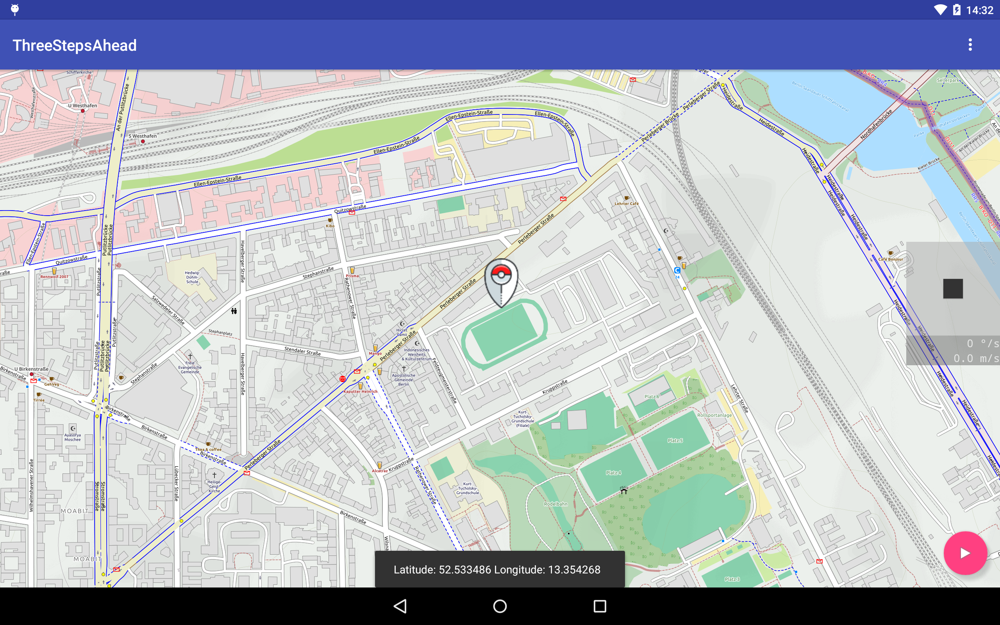
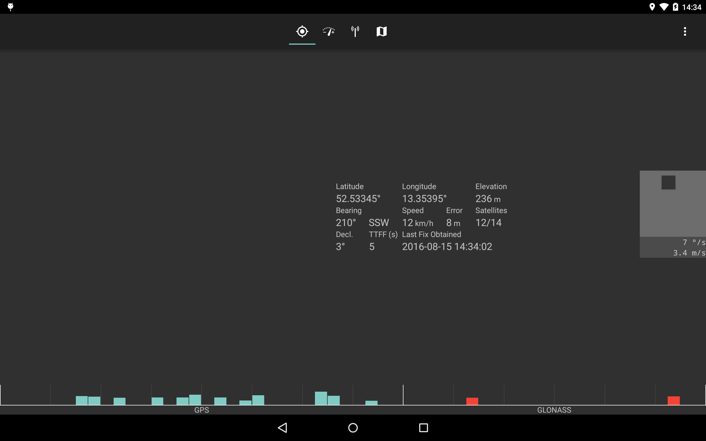

# Three Steps Ahead

This is an Android App which simulates your location, speed, bearing.
It's future goal is to simulate the whole bunch of GPS/GNSS data that the Android API delivers accurately.

## Main App

The main app is currently just a location picker which also starts the joystick overlay service.

On the map you can pick your start location. From there you can go to other apps and move around with the joystick.

## Simulate Location in other Apps

Here are screenshots from [SatStat](https://github.com/mvglasow/satstat) with faked location and the joystick overlay, which lets you move around in the map.

The joystick's horizontal axis determines your angular velocity (default: up to 45 °/s).
The vertical axis determines your translational velocity (default: up to 4.2 m/s).

Speed and bearing are simulated according to your joystick.

## Features

- simulate latitude, longitude, bearing, speed
- choose coarse location in map, move around using joystick
- use altitude, accuracy, TTF from real GPS receiver
- display floating joystick overlay above other apps
- location updates via IPC (no abuse of SharedPreferences)

## TODO

This is *work in progress*.

- disable/enable joystick
- choose hooked Apps
- simulate [GPS satellite status](https://developer.android.com/reference/android/location/GpsSatellite.html)
- simulate altitude (we need another data source for that)
- simulate accuracy (we need heuristics from real GPS data for that)

## Dependencies

- [Xposed Framework](http://forum.xda-developers.com/showthread.php?t=3034811)

## Credits

- App icon made by [Roundicons Freebies](http://www.flaticon.com/authors/roundicons-freebies) ([CC-BY](https://creativecommons.org/licenses/by/3.0/), background added)
- Marker icon made by [freepik](http://www.flaticon.com/authors/freepik) from www.flaticon.com
- Settings Code based on: [xposed-gps](https://github.com/hilarycheng/xposed-gps)
- Map: [OSMDroid](https://github.com/osmdroid/osmdroid), default tiles: [OpenCycleMap](http://www.opencyclemap.org/)
