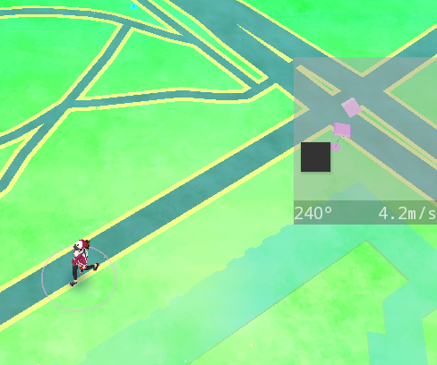

# Three Steps Ahead

This is an Android App which simulates your location, speed, bearing.
Its future goal is to simulate the whole bunch of GPS/GNSS data that the Android API delivers accurately.

## Main App

The main app is currently just a location picker which also starts the joystick overlay service.

On the map you can pick your start location. From there you can go to other apps and move around with the joystick.

## Simulate Location in other Apps

Here are screenshots from [SatStat](https://github.com/mvglasow/satstat) with faked location and the joystick overlay, which lets you move around in the map.

The joystick's horizontal axis determines your angular velocity (default: up to 45 °/s).
The vertical axis determines your translational velocity (default: up to 4.2 m/s).
Speed and bearing are simulated according to your joystick.

## Features

- simulate latitude, longitude, bearing, speed
- calculate [GPS satellite](https://developer.android.com/reference/android/location/GpsSatellite.html) positions and status for simulated location
- use altitude, accuracy, TTF from real GPS receiver
- add noise to appear more realistic
- choose coarse location in map, move around using joystick
- display floating joystick overlay above other apps
- location updates via IPC (no abuse of SharedPreferences)

## TODO

- simulate sensor data
- further research to mimic GPS receiver noise ([SensorRawLogger](https://github.com/spezifisch/SensorRawLogger))
- online update of TLE data
- choose hooked Apps

## Build

- Simply build it with Android Studio
- For `com.android.support:appcompat-v7` in Android Studio go to: Tools >> Android >> SDK Manager and select and install "Extras|Android Support Repository" ([Details](https://stackoverflow.com/a/20830540))

## Install

- Install [Xposed Framework](http://forum.xda-developers.com/showthread.php?t=3034811)
- Install ThreeStepsAhead
- Activate it in Xposed settings
- (Soft) Reboot

## Compatibility

- Android 4.4+

## Credits

- [Xposed Framework](http://forum.xda-developers.com/showthread.php?t=3034811)
- Map: [OSMDroid](https://github.com/osmdroid/osmdroid), default tiles: [OpenStreetMap](https://www.openstreetmap.org/)
- Joystick: [Bugstick](https://github.com/justasm/Bugstick) by justasm
- Satellite calculation: [predict4java](https://github.com/badgersoftdotcom/predict4java) by G4DPZ
- Settings based on: [UnToasted](https://github.com/egingell/UnToasted) by egingell
- App icon made by [Roundicons Freebies](http://www.flaticon.com/authors/roundicons-freebies) ([CC-BY](https://creativecommons.org/licenses/by/3.0/), background added)
- Marker icon made by [freepik](http://www.flaticon.com/authors/freepik) from www.flaticon.com
- Zoom icons from [SatStat](https://github.com/mvglasow/satstat) by mvglasow
