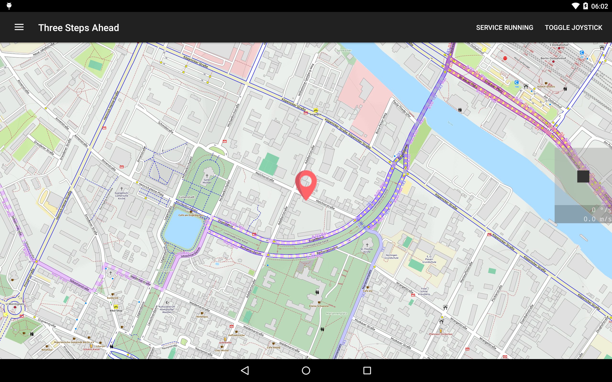
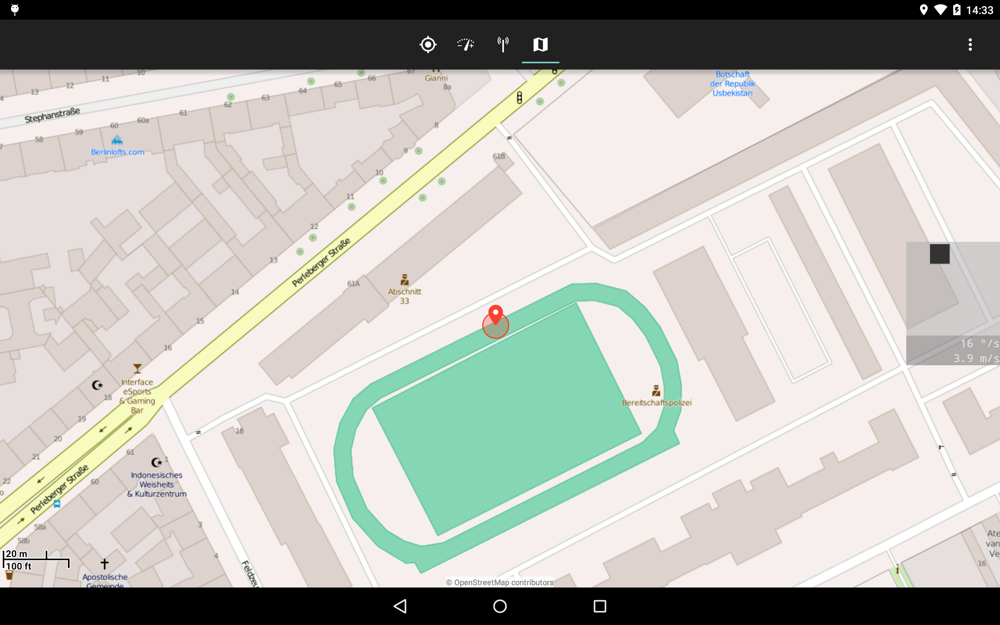
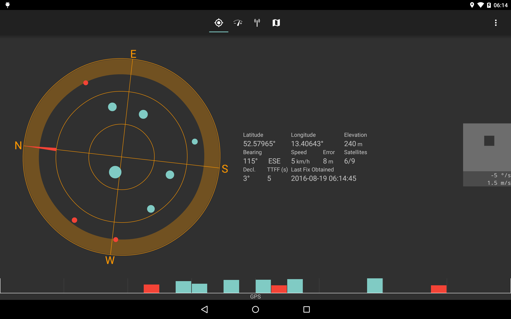

# Three Steps Ahead 

This is an Android App which simulates your location.
Its goal is to simulate the whole bunch of GPS/GNSS and sensor data realistically.

## Download

Grab the most recent release from [Github's Release page](https://github.com/spezifisch/ThreeStepsAhead/releases).

Follow install instructions below!

## Features

- simulate latitude, longitude, bearing, speed
- calculate [GPS satellite](https://developer.android.com/reference/android/location/GpsSatellite.html) positions for simulated location
- use altitude (this is not ideal), accuracy, TTF, location update timings from real GPS receiver
- add noise to appear more realistic
- choose coarse location in map, move around using joystick
- display joystick overlay above other apps
- only hook selected apps (currently a static list: SatStat for testing and PoGo)
- WIP for next release: modify (accelerometer, gyroscope, magnetometer, etc.) sensor data to match simulated movement

## Screenshots

The main app is currently just a location picker which also starts the joystick overlay service.

On the map you can pick your start location. From there you can go to other apps and move around with the joystick.

## Simulate Location in other Apps

Here are screenshots from [SatStat](https://github.com/mvglasow/satstat) with faked location and the joystick overlay, which lets you move around in the map.

The joystick's horizontal axis determines your angular velocity (default: up to 45 °/s).
The vertical axis determines your translational velocity (default: up to 4.2 m/s).
Speed and bearing are simulated according to your joystick.

## Build

- Simply build it with Android Studio
- For `com.android.support:appcompat-v7` in Android Studio go to: Tools >> Android >> SDK Manager and select and install "Extras|Android Support Repository" ([Details](https://stackoverflow.com/a/20830540))

## Install

- Install [Xposed Framework](http://forum.xda-developers.com/showthread.php?t=3034811)
- Install ThreeStepsAhead
- Activate it in Xposed settings
- (Soft) Reboot
- start ThreeStepsAhead and pick a location before starting PoGo

Some hints:

- we rely on a real GPS fix to get realistic accuracy, altitude, and timings.
- GPS only location mode recommended
- disable fused location provider in case of problems
- make sure to disable Mock Locations

## Compatibility

- Android 4.4+, tested with 4.4 - 6.0

## Permissions

- Network/State: needed for map service
- Storage: needed for map tile caching
- Draw Overlays/AlertWindow: needed to draw joystick overlay over other apps

## Credits

- [Xposed Framework](http://forum.xda-developers.com/showthread.php?t=3034811)
- Map: [OSMDroid](https://github.com/osmdroid/osmdroid), default tiles: [OpenStreetMap](https://www.openstreetmap.org/)
- Joystick: [Bugstick](https://github.com/justasm/Bugstick) by justasm
- Satellite calculation: [predict4java](https://github.com/badgersoftdotcom/predict4java) by G4DPZ
- Settings based on: [UnToasted](https://github.com/egingell/UnToasted) by egingell
- App icon made by [Roundicons Freebies](http://www.flaticon.com/authors/roundicons-freebies) ([CC-BY](https://creativecommons.org/licenses/by/3.0/), background added)
- Marker icon made by [freepik](http://www.flaticon.com/authors/freepik) from www.flaticon.com
- Zoom icons from [SatStat](https://github.com/mvglasow/satstat) by mvglasow
